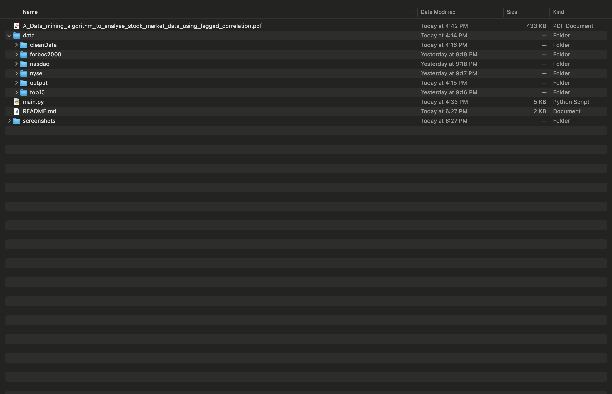
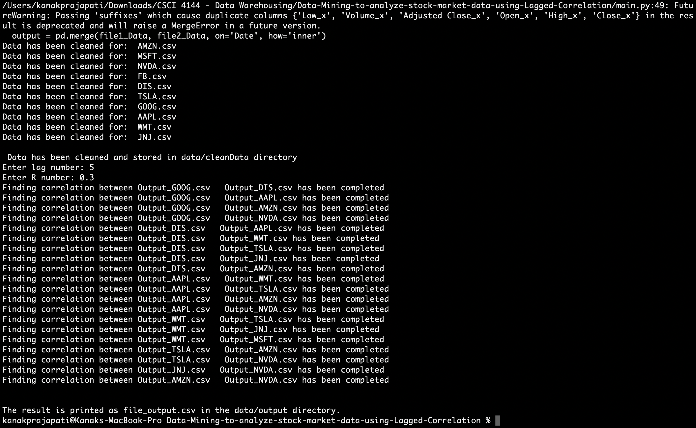
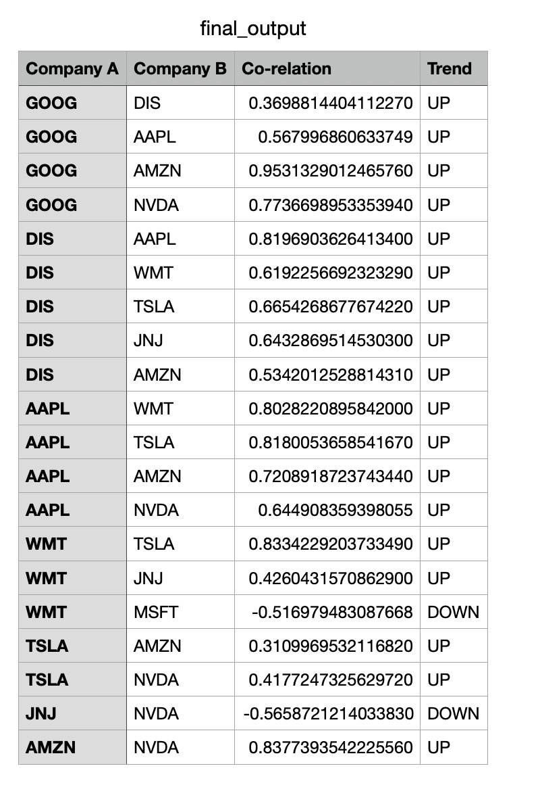

# Analyzing Stock Market Data using Lagged Correlation Data Mining Algorithm.

## Project Description

In this project, I have developed a lagged correlation algorithm for predicting the market direction more accurately when two stocks are strongly correlated to each other with a lag of K number of trading days.

- Technology Stack

  - [Anaconda](https://docs.anaconda.com/anaconda/install/index.html)
  - [Jupyter Notebook](https://jupyter.org/install)
  - [PyCharm IDE](https://www.jetbrains.com/pycharm/)
  - [Python](https://www.python.org/downloads/)

    - Dependecies Used: pandas, csv, glob, and os

- Challanges

  - The program requires huge computational power to perform analysis on a massive dataset.

  - The testing of dataset is a time consuming process. So, I assembled a manual dataset of Top 10 stocks to perform quick analysis.

## Project Structure

```
+-- main.py
|-- data
|   +-- cleanData
|   +-- forbes2000
|   +-- nasdaq
|   +-- nyse
|   +-- output
|   +-- top10
+-- Readme.md
+-- Readme.txt
+-- screenshots
+-- A_Data_mining_algorithm_to_analyse_stock_market_data_using_lagged_correlation.pdf

```



---

## Demo

- User is asked to enter lag number and R number.

  

## Sample Output

- This is the sample correlation output for top 10 stocks.

  

### Reading the Output

- The output of the program is in csv file as "final_output.csv" in data/output directory. The output has 4 columns:
  - Company A: Stock of a company.
  - Company B: Stocks being correlated to Column A.
  - Correlation: The value of correlation. If the value is near to +1, it has a positive correlation. If the value is near to -1, it has negative correlation. If the value is 0, correaltion does not exists between Company A and Company B.
  - Trend: Based on Correlation column. If greater than 0, it will show Up trend. If less than 0 it will show Down trend.

## Using the Project

1. Go to the source folder and run the following command:

   ```bash
      python main.py
   ```

2. User will be asked to enter the lag (Number of days) and R (Correlation). Sample input can be 5 for lag number and 0.3 for R number.

   ```bash
      Enter lag number: 5
      Enter R number: 0.3
   ```

3. The output will be saved in data/output directory. To check the output run the following commands in terminal:

   ```bash
        cd data/output
   ```

```bash
    vim final_output.csv
```

---

## References

- Dataset - The [Stock Market Data(NASDAQ, NYSE, S&P500)](https://www.kaggle.com/paultimothymooney/stock-market-data) used for this project was from kaggle.com. The dataset contains Date, Volume, High, Low, and Closing Price (for all NASDAQ, S&P500, and NYSE listed companies), which is updated weekly by [Paul Mooney](https://www.kaggle.com/paultimothymooney).

- Research Paper - The program implements the lagged correlation algorithm based on
  [A Data mining algorithm to analyse stock market data
  using lagged correlation](https://ieeexplore.ieee.org/abstract/document/4783968) research paper.
